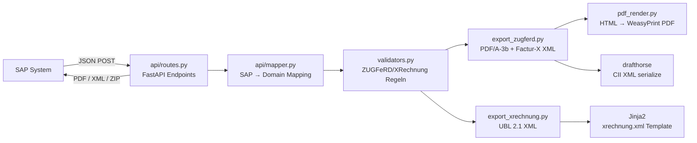
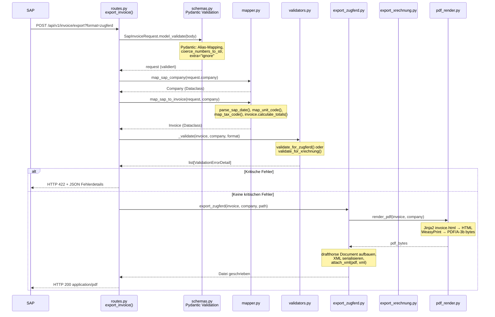
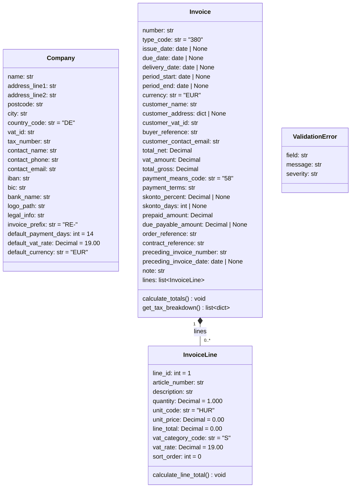
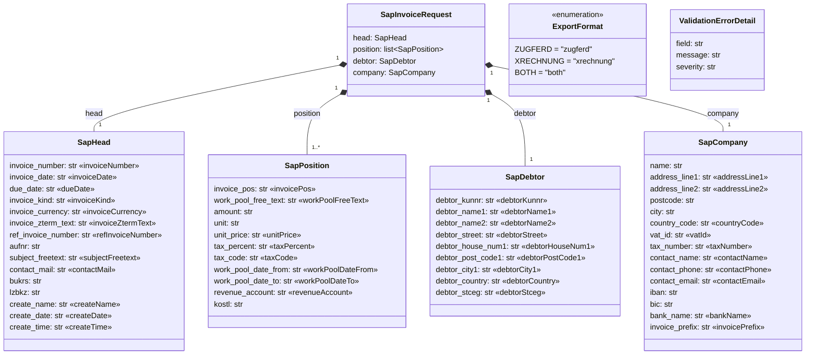
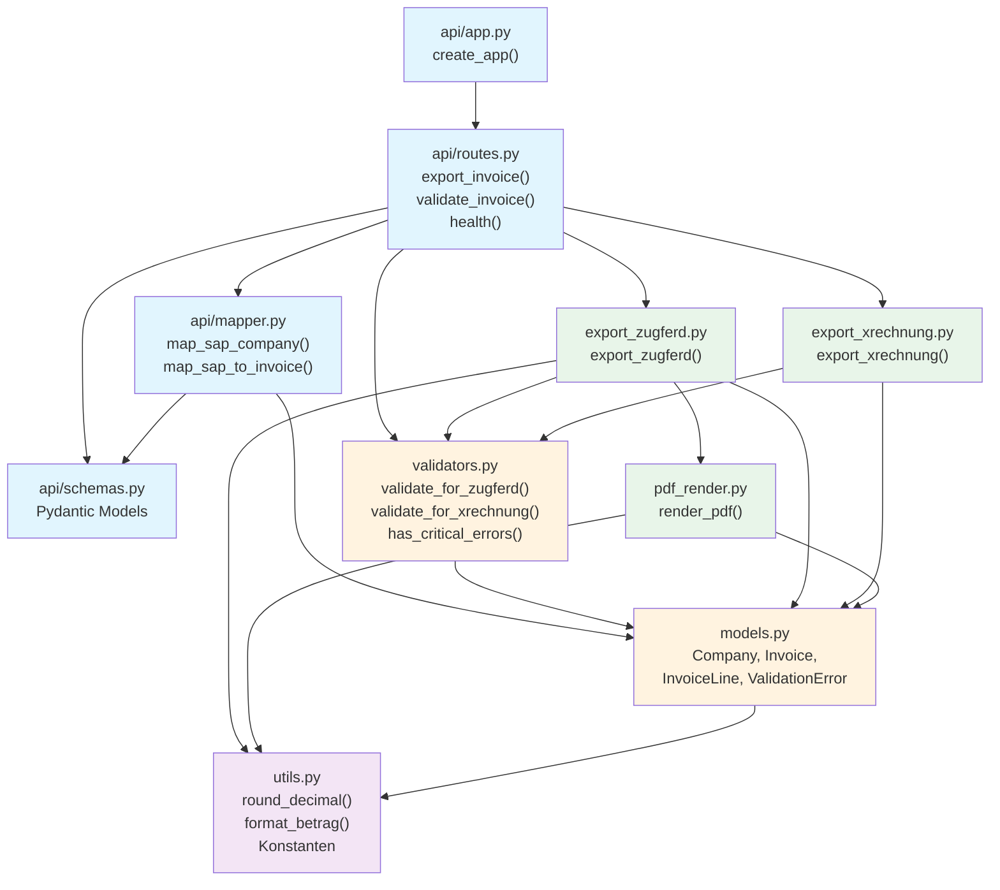
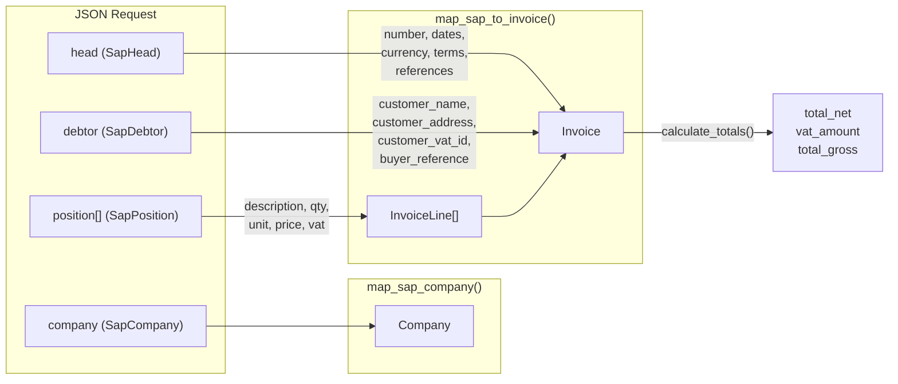

# E-Rechnung API — Architektur & Flow

Stateless REST API zur Erzeugung von ZUGFeRD-PDFs und XRechnung-XMLs aus SAP-Rechnungsdaten.

[English version](MANUAL.md)

---

## 1. Architektur-Ueberblick

Die API besteht aus fuenf Schichten: Eingang (FastAPI), Mapping (SAP → Domain), Validierung, Export (PDF/XML-Erzeugung) und Hilfsfunktionen.



- **api/app.py** — FastAPI-Instanz erstellen, Router einbinden
- **api/routes.py** — drei Endpoints: `/invoice/export`, `/invoice/validate`, `/health`
- **api/schemas.py** — Pydantic-Modelle fuer JSON-Validierung (SAP-Format mit Aliases)
- **api/mapper.py** — SAP-Datenstruktur in Domain-Dataclasses uebersetzen
- **models.py** — Plain-Dataclasses: `Company`, `Invoice`, `InvoiceLine`, `ValidationError`
- **validators.py** — Geschaeftsregeln fuer ZUGFeRD und XRechnung
- **export_zugferd.py** — PDF/A-3b mit eingebettetem Factur-X XML (drafthorse)
- **export_xrechnung.py** — UBL 2.1 XML (Jinja2-Template)
- **pdf_render.py** — HTML-Template → PDF via WeasyPrint
- **utils.py** — Rundung, Formatierung, Konstanten

---

## 2. Request-Flow

### 2.1 Export-Endpoint (`POST /api/v1/invoice/export`)

Der komplette Ablauf eines Export-Requests von SAP bis zur Response:



**Schritt-fuer-Schritt:**

1. SAP sendet JSON-POST mit `head`, `position[]`, `debtor` und `company`
2. **Pydantic** (schemas.py) validiert den Body, mappt camelCase-Aliases, erzwingt Strings fuer numerische Felder, ignoriert unbekannte Felder
3. **map_sap_company()** wandelt `SapCompany` → `Company` Dataclass
4. **map_sap_to_invoice()** wandelt den gesamten Request in `Invoice` + `InvoiceLine[]`, berechnet Summen
5. **_validate()** prueft Geschaeftsregeln (Pflichtfelder, Betraege, XRechnung-Extras)
6. Bei kritischen Fehlern: HTTP 422 mit Fehlerdetails
7. Ohne Fehler: Export in Temp-Verzeichnis, Response als `application/pdf`, `application/xml` oder `application/zip`

### 2.2 Validate-Endpoint (`POST /api/v1/invoice/validate`)

Gleicher Flow wie Export, aber ohne Schritt 7 (kein Export). Gibt stattdessen JSON zurueck:

```json
{"valid": true, "errors": []}
```

### 2.3 Health-Endpoint (`GET /api/v1/health`)

Gibt `{"status": "ok"}` zurueck. Kein Mapping, keine Validierung.

---

## 3. Klassendiagramm — Domain-Modelle

Alle Domain-Objekte sind Plain-Python-Dataclasses ohne externe Abhaengigkeiten (ausser `utils.round_decimal`).



### Company (`models.py`)

Verkaeuferdaten. Alle Felder haben Defaults (leerer String bzw. Standardwerte). Wird aus dem `company`-Block des JSON-Requests gemappt.

### Invoice (`models.py`)

Rechnungskopf inkl. Kundendaten (Snapshot), Summen, Zahlungsinformationen und Referenzen.

- **`calculate_totals()`** — iteriert ueber `lines`, ruft je `calculate_line_total()` auf, gruppiert nach USt-Satz, berechnet `total_net`, `vat_amount`, `total_gross`, `due_payable_amount`
- **`get_tax_breakdown()`** — gibt eine Liste von Dicts zurueck mit `category_code`, `rate`, `basis_amount`, `tax_amount` pro USt-Gruppe (sortiert)

### InvoiceLine (`models.py`)

Einzelne Rechnungsposition.

- **`calculate_line_total()`** — setzt `line_total = round_decimal(quantity * unit_price)`

### ValidationError (`models.py`)

Einfacher Container mit `field`, `message` und `severity` (`"error"` oder `"warning"`).

---

## 4. Klassendiagramm — Pydantic Schemas (API-Schicht)



Alle Schemas verwenden `ConfigDict(populate_by_name=True, extra="ignore")`. `SapHead`, `SapPosition` und `SapDebtor` nutzen zusaetzlich `coerce_numbers_to_str=True`, damit SAP sowohl Strings als auch Zahlen senden kann. Die «»-Annotationen zeigen die JSON-Alias-Namen (camelCase von SAP).

---

## 5. Modul-Abhaengigkeiten



- **Blau** — API-Schicht (FastAPI, Pydantic, Mapping)
- **Orange** — Domain-Schicht (Dataclasses, Validierung)
- **Gruen** — Export-Schicht (PDF/XML-Erzeugung)
- **Lila** — Utilities (keine externen Abhaengigkeiten)

---

## 6. Funktionen pro Modul

### 6.1 `api/app.py`

| Funktion | Signatur | Beschreibung |
|---|---|---|
| `create_app` | `() -> FastAPI` | Erstellt FastAPI-Instanz, bindet Router ein |

### 6.2 `api/routes.py`

| Funktion | Signatur | Beschreibung |
|---|---|---|
| `_validate` | `(invoice, company, fmt: ExportFormat) -> list[ValidationErrorDetail]` | Waehlt Validierungsstrategie je nach Format, wandelt `ValidationError` → `ValidationErrorDetail` |
| `export_invoice` | `(request: SapInvoiceRequest, format: ExportFormat) -> Response` | **POST /api/v1/invoice/export** — Mappt, validiert, exportiert. Gibt PDF, XML oder ZIP zurueck |
| `validate_invoice` | `(request: SapInvoiceRequest, format: ExportFormat) -> dict` | **POST /api/v1/invoice/validate** — Mappt, validiert, gibt JSON mit `valid` + `errors` zurueck |
| `health` | `() -> dict` | **GET /api/v1/health** — Gibt `{"status": "ok"}` zurueck |

### 6.3 `api/schemas.py`

Pydantic-Modelle (siehe Klassendiagramm oben):

| Klasse | Beschreibung |
|---|---|
| `ExportFormat` | Enum: `zugferd`, `xrechnung`, `both` |
| `SapHead` | Rechnungskopfdaten (camelCase-Aliases, coerce_numbers_to_str) |
| `SapPosition` | Rechnungsposition (camelCase-Aliases, coerce_numbers_to_str) |
| `SapDebtor` | Rechnungsempfaenger (camelCase-Aliases, coerce_numbers_to_str) |
| `SapCompany` | Verkaeuferdaten (camelCase-Aliases) |
| `SapInvoiceRequest` | Top-Level-Request: head + position[] + debtor + company |
| `ValidationErrorDetail` | Fehler-Response: field, message, severity |

### 6.4 `api/mapper.py`

| Funktion / Konstante | Signatur | Beschreibung |
|---|---|---|
| `SAP_UNIT_MAP` | `dict[str, str]` | Mapping SAP-Einheiten → UN/CEFACT (ST→C62, STD→HUR, TAG→DAY, ...) |
| `SAP_TAX_CODE_MAP` | `dict[str, str]` | Mapping SAP-Steuerkennzeichen → USt-Kategorie (erweiterbar) |
| `SAP_KIND_MAP` | `dict[str, str]` | Mapping SAP-Rechnungsart → Typcode (erweiterbar, z.B. G→381) |
| `parse_sap_date` | `(value: str) -> date \| None` | Parst YYYYMMDD oder YYYY-MM-DD, gibt `None` fuer leere Strings |
| `map_unit_code` | `(sap_unit: str) -> str` | Uebersetzt SAP-Einheit via `SAP_UNIT_MAP`, Passthrough bei Unbekannt |
| `map_tax_code` | `(tax_code: str, tax_percent: Decimal) -> str` | Bestimmt USt-Kategorie: Map-Lookup, dann Fallback auf Rate (0→Z, sonst→S) |
| `_nonempty` | `(value: str) -> str` | Behandelt SAPs `"0"` und `""` als leer |
| `map_sap_company` | `(data: SapCompany) -> Company` | 1:1-Mapping Pydantic → Dataclass |
| `map_sap_to_invoice` | `(request: SapInvoiceRequest, company: Company) -> Invoice` | Komplettes Mapping: Head → Invoice-Felder, Debtor → Kunden-Snapshot, Position[] → InvoiceLine[], Perioden-Aggregation, `calculate_totals()` |

### 6.5 `models.py`

| Klasse / Methode | Beschreibung |
|---|---|
| `Company` | Dataclass: Verkaeuferdaten (20 Felder) |
| `InvoiceLine` | Dataclass: Rechnungsposition (10 Felder) |
| `InvoiceLine.calculate_line_total()` | Setzt `line_total = round_decimal(quantity * unit_price)` |
| `Invoice` | Dataclass: Rechnung (29 Felder + `lines`) |
| `Invoice.calculate_totals()` | Berechnet `total_net`, `vat_amount`, `total_gross`, `due_payable_amount` ueber alle Lines, gruppiert nach USt-Satz |
| `Invoice.get_tax_breakdown()` | Gibt sortierte Liste der USt-Gruppen zurueck: `[{category_code, rate, basis_amount, tax_amount}]` |
| `ValidationError` | Dataclass: `field`, `message`, `severity` |

### 6.6 `validators.py`

| Funktion | Signatur | Beschreibung |
|---|---|---|
| `validate_for_zugferd` | `(invoice: Invoice, company: Company) -> list[ValidationError]` | Prueft Pflichtfelder fuer ZUGFeRD: Firmenname, Adresse, USt-ID/Steuernr, IBAN, Kundenname, Kundenadresse, Rechnungsnummer, Datum, Positionen, Nettobetrag > 0. Warnungen: Kontaktdaten |
| `validate_for_xrechnung` | `(invoice: Invoice, company: Company) -> list[ValidationError]` | Ruft `validate_for_zugferd()` auf + prueft zusaetzlich: `buyer_reference` (Leitweg-ID) und `customer_contact_email` |
| `has_critical_errors` | `(errors: list[ValidationError]) -> bool` | `True` wenn mindestens ein Error mit `severity == "error"` |

### 6.7 `export_zugferd.py`

| Funktion / Konstante | Signatur | Beschreibung |
|---|---|---|
| `_EXEMPTION_MAP` | `dict[str, tuple[str, str]]` | USt-Befreiungscodes: K→VATEX-EU-IC, G→VATEX-EU-EXP, AE→VATEX-EU-AE, E→VATEX-EU-132 |
| `create_trade_tax` | `(amount, basis_amount, category_code, vat_rate) -> ApplicableTradeTax` | Erstellt ein drafthorse-Steuerobjekt inkl. Befreiungsgrund falls applicable |
| `create_line_item` | `(line: InvoiceLine) -> LineItem` | Erstellt ein drafthorse-LineItem: Produkt, Preis, Menge, Steuer, Summe |
| `export_zugferd` | `(invoice: Invoice, company: Company, output_path: str) -> None` | Hauptfunktion: validiert, rendert PDF, baut CII-XML via drafthorse (Seller, Buyer, Referenzen, Lieferung, Zahlung, Positionen, Steuern, Summen), haengt XML an PDF an |

### 6.8 `export_xrechnung.py`

| Funktion / Konstante | Signatur | Beschreibung |
|---|---|---|
| `TEMPLATES_DIR` | `Path` | Pfad zum `templates/`-Verzeichnis |
| `_EXEMPTION_REASONS` | `dict[str, str]` | USt-Befreiungsgruende fuer UBL-Template |
| `export_xrechnung` | `(invoice: Invoice, company: Company, output_path: str) -> None` | Validiert, rendert `xrechnung.xml` Jinja2-Template, prueft XML-Wohlgeformtheit via lxml, schreibt Datei |

### 6.9 `pdf_render.py`

| Funktion / Konstante | Signatur | Beschreibung |
|---|---|---|
| `TEMPLATES_DIR` | `Path` | Pfad zum `templates/`-Verzeichnis |
| `render_pdf` | `(invoice: Invoice, company: Company) -> bytes` | Rendert `invoice.html` via Jinja2 (mit `betrag`-Filter), erzeugt PDF/A-3b via WeasyPrint |

### 6.10 `utils.py`

| Funktion / Konstante | Signatur | Beschreibung |
|---|---|---|
| `FACTUR_X_GUIDELINE` | `str` | URN fuer Factur-X Extended Profil |
| `PROFILE` | `str` | `"EXTENDED"` |
| `VAT_CODES` | `dict[str, str]` | Mapping Steuerschluessel → USt-Kategorie |
| `UNIT_CODES` | `list[tuple]` | UN/CEFACT-Einheiten mit DE/EN-Bezeichnung |
| `VAT_CATEGORIES` | `list[tuple]` | USt-Kategorien mit Satz, Befreiungsgrund, Code |
| `round_decimal` | `(value, decimals=2) -> Decimal` | Kaufmaennisch runden (ROUND_HALF_UP) |
| `format_betrag` | `(value) -> str` | Deutsche Betragsformatierung: `1.234,56` |
| `format_invoice_number` | `(prefix, year, counter, width=5) -> str` | Formatiert z.B. `RE-2026-00001` |

---

## 7. Export-Detail: ZUGFeRD vs. XRechnung

```mermaid
graph TD
    subgraph ZUGFeRD ["ZUGFeRD (export_zugferd.py)"]
        Z1["validate_for_zugferd()"] --> Z2["render_pdf()<br>invoice.html → PDF/A-3b"]
        Z2 --> Z3["drafthorse Document<br>CII XML aufbauen"]
        Z3 --> Z4["doc.serialize()<br>FACTUR-X_EXTENDED"]
        Z4 --> Z5["attach_xml()<br>XML in PDF einbetten"]
        Z5 --> Z6["invoice.pdf<br>PDF/A-3b + Factur-X"]
    end

    subgraph XRechnung ["XRechnung (export_xrechnung.py)"]
        X1["validate_for_xrechnung()"] --> X2["Jinja2 render<br>xrechnung.xml Template"]
        X2 --> X3["lxml.etree.fromstring()<br>XML Wohlgeformtheit"]
        X3 --> X4["invoice.xml<br>UBL 2.1"]
    end
```



### ZUGFeRD-Pipeline

1. **Validierung** — `validate_for_zugferd()`: Pflichtfelder pruefen
2. **PDF rendern** — `render_pdf()`: Jinja2 `invoice.html` → HTML → WeasyPrint PDF/A-3b
3. **CII-XML aufbauen** — drafthorse `Document`: Header, Seller, Buyer, Referenzen, Lieferdaten, Zahlungsmittel, Zahlungsbedingungen (inkl. Skonto), Positionen, Steueraufschluesselung, Summenblock
4. **XML serialisieren** — `doc.serialize(schema="FACTUR-X_EXTENDED")`
5. **XML einbetten** — `attach_xml(pdf_bytes, xml_data)`: Factur-X XML als Attachment in PDF/A-3b
6. **Datei schreiben** — ZUGFeRD-konforme PDF

### XRechnung-Pipeline

1. **Validierung** — `validate_for_xrechnung()`: ZUGFeRD-Regeln + Leitweg-ID + Kaeufer-E-Mail
2. **XML rendern** — Jinja2 `xrechnung.xml` Template mit Invoice, Company, Adresse, Steueraufschluesselung
3. **XML pruefen** — `lxml.etree.fromstring()` stellt Wohlgeformtheit sicher
4. **Datei schreiben** — UBL 2.1 konformes XML

---

## 8. Datenfluss: SAP-JSON → Domain-Objekte



### Feld-Mapping im Detail

**SapHead → Invoice:**

| SAP-Feld (camelCase) | Domain-Feld | Transformation |
|---|---|---|
| `invoiceNumber` | `number` | `company.invoice_prefix` + Wert (leer wenn "0") |
| `invoiceDate` | `issue_date` | `parse_sap_date()` YYYYMMDD/ISO |
| `dueDate` | `due_date` | `parse_sap_date()` |
| `invoiceKind` | `type_code` | `SAP_KIND_MAP` Lookup, Default "380" |
| `invoiceCurrency` | `currency` | Direkt, Default "EUR" |
| `invoiceZtermText` | `payment_terms` | Direkt |
| `refInvoiceNumber` | `preceding_invoice_number` | `_nonempty()` ("0" → "") |
| `aufnr` | `order_reference` | `_nonempty()` |
| `subjectFreetext` | `note` | Direkt |
| `contactMail` | `customer_contact_email` | Direkt |

**SapDebtor → Invoice (Kunden-Snapshot):**

| SAP-Feld | Domain-Feld | Transformation |
|---|---|---|
| `debtorName1` + `debtorName2` | `customer_name` | Concatenation mit Space |
| `debtorStreet` + `debtorHouseNum1` | `customer_address.address_line1` | Concatenation |
| `debtorPostCode1` | `customer_address.postcode` | Direkt |
| `debtorCity1` | `customer_address.city` | Direkt |
| `debtorCountry` | `customer_address.country_code` | Default "DE" |
| `debtorStceg` | `customer_vat_id` | Direkt |
| `debtorKunnr` | `buyer_reference` | Direkt |

**SapPosition → InvoiceLine:**

| SAP-Feld | Domain-Feld | Transformation |
|---|---|---|
| `invoicePos` | `line_id`, `sort_order` | `int()` |
| `workPoolFreeText` | `description` | Direkt |
| `amount` | `quantity` | `Decimal()`, Fallback 1 |
| `unit` | `unit_code` | `map_unit_code()` via `SAP_UNIT_MAP` |
| `unitPrice` | `unit_price` | `Decimal()`, Fallback 0 |
| `taxPercent` | `vat_rate` | `Decimal()`, Fallback 19 |
| `taxCode` + `taxPercent` | `vat_category_code` | `map_tax_code()` |
| `workPoolDateFrom` | → `invoice.period_start` | `min()` ueber alle Positionen |
| `workPoolDateTo` | → `invoice.period_end` | `max()` ueber alle Positionen |

**SapCompany → Company:** 1:1-Mapping aller 15 Felder.

---

## 9. Validierungsregeln

```mermaid
graph TD
    subgraph ZUGFeRD ["validate_for_zugferd()"]
        direction TB
        C1["firma.name ≠ leer"] --> |error| E
        C2["firma.address_line1 ≠ leer"] --> |error| E
        C3["firma.postcode ≠ leer"] --> |error| E
        C4["firma.city ≠ leer"] --> |error| E
        C5["firma.vat_id ODER tax_number"] --> |error| E
        C6["firma.iban ≠ leer"] --> |error| E
        C7["firma.contact_name"] --> |warning| E
        C8["firma.contact_email"] --> |warning| E
        C9["firma.contact_phone"] --> |warning| E
        C10["kunde.name ≠ leer"] --> |error| E
        C11["kunde.address_line1"] --> |error| E
        C12["kunde.postcode"] --> |error| E
        C13["kunde.city"] --> |error| E
        C14["rechnung.number ≠ leer"] --> |error| E
        C15["rechnung.issue_date ≠ None"] --> |error| E
        C16["rechnung.lines ≠ leer"] --> |error| E
        C17["rechnung.total_net > 0"] --> |error| E
        E["list~ValidationError~"]
    end

    subgraph XRechnung ["validate_for_xrechnung() — zusaetzlich"]
        direction TB
        X1["kunde.buyer_reference ≠ leer<br>(Leitweg-ID)"] --> |error| E2
        X2["kunde.contact_email ≠ leer<br>(Kaeufer E-Mail)"] --> |error| E2
        E2["+ ZUGFeRD-Errors"]
    end
```



### ZUGFeRD-Pflichtfelder (Errors)

- Firmenname, Adresse (Strasse, PLZ, Ort), USt-ID oder Steuernummer, IBAN
- Kundenname, Kundenadresse (Strasse, PLZ, Ort)
- Rechnungsnummer, Rechnungsdatum, min. 1 Position, Nettobetrag > 0

### ZUGFeRD-Empfehlungen (Warnings)

- Ansprechpartner Name, E-Mail, Telefon

### XRechnung-Zusatzpflicht (Errors)

- Leitweg-ID (`buyer_reference`)
- Kaeufer-E-Mail (`customer_contact_email`)

---

## 10. Dateistruktur

```
src/e_rechnung/
├── api/
│   ├── __init__.py
│   ├── app.py              # create_app()
│   ├── routes.py            # export_invoice(), validate_invoice(), health()
│   ├── schemas.py           # Pydantic: SapInvoiceRequest, SapCompany, ...
│   └── mapper.py            # map_sap_company(), map_sap_to_invoice()
├── models.py                # Company, Invoice, InvoiceLine, ValidationError
├── validators.py            # validate_for_zugferd(), validate_for_xrechnung()
├── export_zugferd.py        # export_zugferd(), create_trade_tax(), create_line_item()
├── export_xrechnung.py      # export_xrechnung()
├── pdf_render.py            # render_pdf()
└── utils.py                 # round_decimal(), format_betrag(), Konstanten

templates/
├── invoice.html             # Jinja2 PDF-Template
├── invoice.css              # PDF-Styles
└── xrechnung.xml            # Jinja2 UBL 2.1 Template

tests/
├── conftest.py              # Shared Fixtures (Company)
├── test_api.py              # API-Integrationstests
├── test_mapper.py           # Mapper Unit-Tests
├── test_validators.py       # Validierungs-Tests
├── test_export_zugferd.py   # ZUGFeRD Export-Tests
├── test_export_xrechnung.py # XRechnung Export-Tests
├── test_utils.py            # Utils-Tests
└── data/
    ├── dummy.json           # Vollstaendiger SAP-Beispiel-Request
    └── beispiel.json        # Leeres SAP-Template
```
