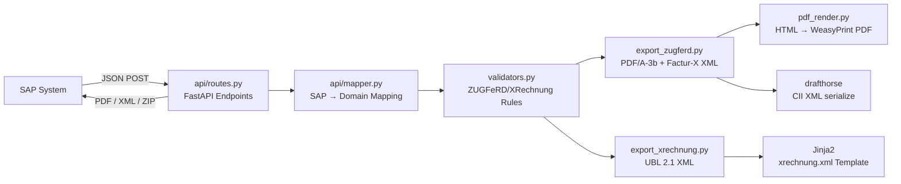
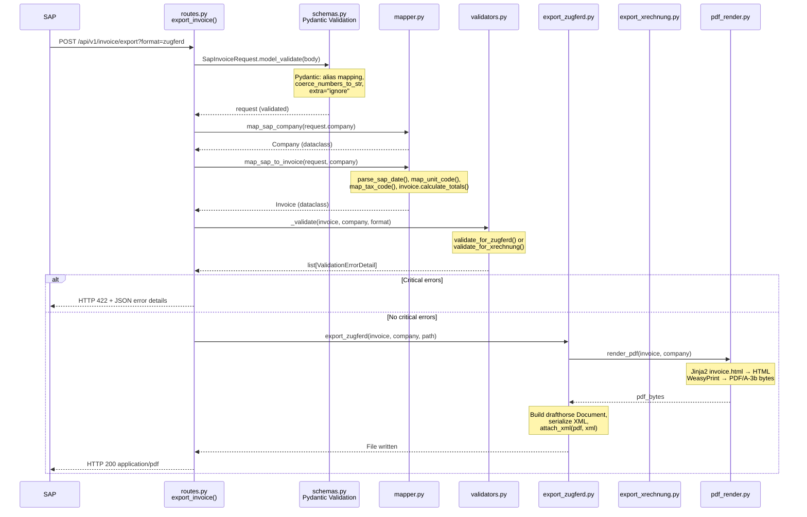
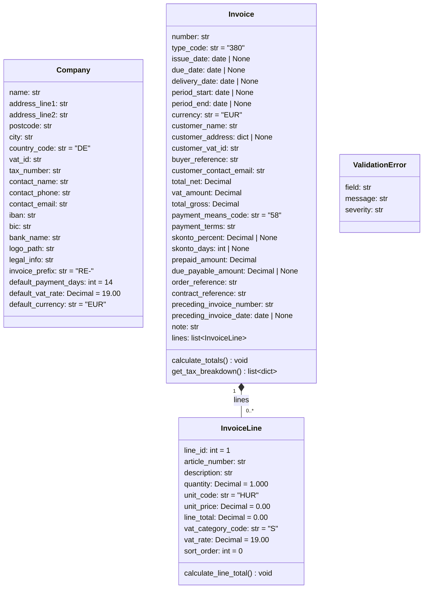
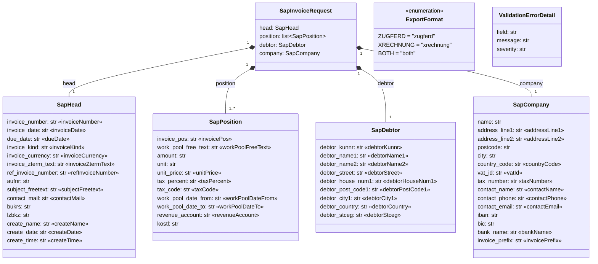
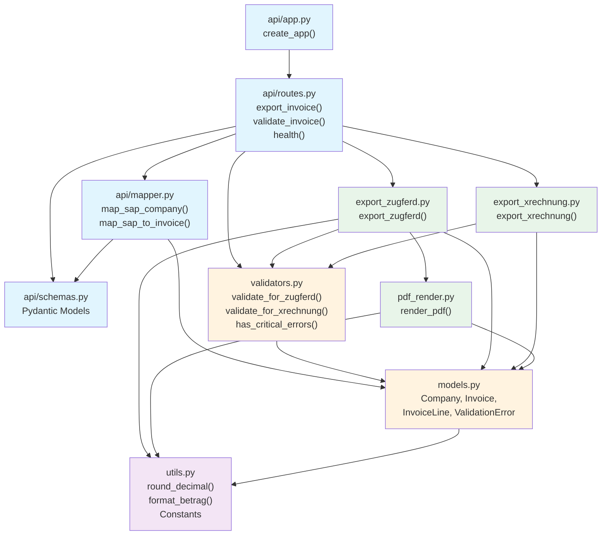
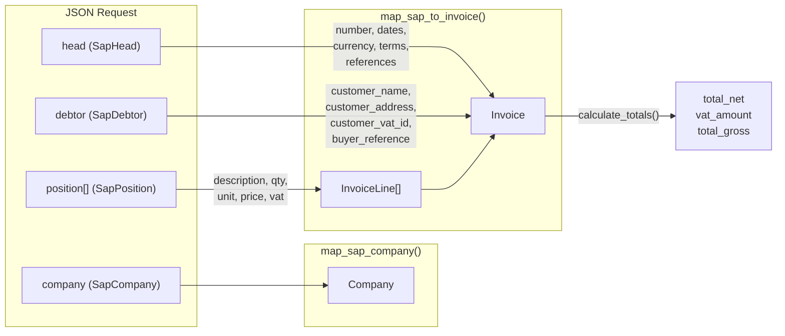

# E-Rechnung API — Architecture & Flow

Stateless REST API for generating ZUGFeRD PDFs and XRechnung XMLs from SAP invoice data.

[Deutsche Version](MANUAL.de.md)

---

## 1. Architecture Overview

The API consists of five layers: ingress (FastAPI), mapping (SAP to domain), validation, export (PDF/XML generation), and utilities.



- **api/app.py** — Create FastAPI instance, mount router
- **api/routes.py** — Three endpoints: `/invoice/export`, `/invoice/validate`, `/health`
- **api/schemas.py** — Pydantic models for JSON validation (SAP format with aliases)
- **api/mapper.py** — Translate SAP data structures into domain dataclasses
- **models.py** — Plain dataclasses: `Company`, `Invoice`, `InvoiceLine`, `ValidationError`
- **validators.py** — Business rules for ZUGFeRD and XRechnung
- **export_zugferd.py** — PDF/A-3b with embedded Factur-X XML (drafthorse)
- **export_xrechnung.py** — UBL 2.1 XML (Jinja2 template)
- **pdf_render.py** — HTML template to PDF via WeasyPrint
- **utils.py** — Rounding, formatting, constants

---

## 2. Request Flow

### 2.1 Export Endpoint (`POST /api/v1/invoice/export`)

Complete flow of an export request from SAP to response:



**Step by step:**

1. SAP sends JSON POST with `head`, `position[]`, `debtor`, and `company`
2. **Pydantic** (schemas.py) validates the body, maps camelCase aliases, coerces numbers to strings, ignores unknown fields
3. **map_sap_company()** converts `SapCompany` to `Company` dataclass
4. **map_sap_to_invoice()** converts the entire request into `Invoice` + `InvoiceLine[]`, calculates totals
5. **_validate()** checks business rules (required fields, amounts, XRechnung extras)
6. On critical errors: HTTP 422 with error details
7. Without errors: export to temp directory, respond with `application/pdf`, `application/xml`, or `application/zip`

### 2.2 Validate Endpoint (`POST /api/v1/invoice/validate`)

Same flow as export, but without step 7 (no export). Returns JSON instead:

```json
{"valid": true, "errors": []}
```

### 2.3 Health Endpoint (`GET /api/v1/health`)

Returns `{"status": "ok"}`. No mapping, no validation.

---

## 3. Class Diagram — Domain Models

All domain objects are plain Python dataclasses with no external dependencies (except `utils.round_decimal`).



### Company (`models.py`)

Seller data. All fields have defaults (empty string or standard values). Mapped from the `company` block of the JSON request.

### Invoice (`models.py`)

Invoice header including customer data (snapshot), totals, payment information, and references.

- **`calculate_totals()`** — iterates over `lines`, calls `calculate_line_total()` on each, groups by VAT rate, calculates `total_net`, `vat_amount`, `total_gross`, `due_payable_amount`
- **`get_tax_breakdown()`** — returns a sorted list of dicts with `category_code`, `rate`, `basis_amount`, `tax_amount` per VAT group

### InvoiceLine (`models.py`)

Single invoice line item.

- **`calculate_line_total()`** — sets `line_total = round_decimal(quantity * unit_price)`

### ValidationError (`models.py`)

Simple container with `field`, `message`, and `severity` (`"error"` or `"warning"`).

---

## 4. Class Diagram — Pydantic Schemas (API Layer)



All schemas use `ConfigDict(populate_by_name=True, extra="ignore")`. `SapHead`, `SapPosition`, and `SapDebtor` additionally use `coerce_numbers_to_str=True` so SAP can send both strings and numbers. The guillemets show JSON alias names (camelCase from SAP).

---

## 5. Module Dependencies



- **Blue** — API layer (FastAPI, Pydantic, mapping)
- **Orange** — Domain layer (dataclasses, validation)
- **Green** — Export layer (PDF/XML generation)
- **Purple** — Utilities (no external dependencies)

---

## 6. Functions by Module

### 6.1 `api/app.py`

| Function | Signature | Description |
|---|---|---|
| `create_app` | `() -> FastAPI` | Creates FastAPI instance, mounts router |

### 6.2 `api/routes.py`

| Function | Signature | Description |
|---|---|---|
| `_validate` | `(invoice, company, fmt: ExportFormat) -> list[ValidationErrorDetail]` | Selects validation strategy by format, converts `ValidationError` to `ValidationErrorDetail` |
| `export_invoice` | `(request: SapInvoiceRequest, format: ExportFormat) -> Response` | **POST /api/v1/invoice/export** — Maps, validates, exports. Returns PDF, XML, or ZIP |
| `validate_invoice` | `(request: SapInvoiceRequest, format: ExportFormat) -> dict` | **POST /api/v1/invoice/validate** — Maps, validates, returns JSON with `valid` + `errors` |
| `health` | `() -> dict` | **GET /api/v1/health** — Returns `{"status": "ok"}` |

### 6.3 `api/schemas.py`

Pydantic models (see class diagram above):

| Class | Description |
|---|---|
| `ExportFormat` | Enum: `zugferd`, `xrechnung`, `both` |
| `SapHead` | Invoice header data (camelCase aliases, coerce_numbers_to_str) |
| `SapPosition` | Invoice line item (camelCase aliases, coerce_numbers_to_str) |
| `SapDebtor` | Invoice recipient (camelCase aliases, coerce_numbers_to_str) |
| `SapCompany` | Seller data (camelCase aliases) |
| `SapInvoiceRequest` | Top-level request: head + position[] + debtor + company |
| `ValidationErrorDetail` | Error response: field, message, severity |

### 6.4 `api/mapper.py`

| Function / Constant | Signature | Description |
|---|---|---|
| `SAP_UNIT_MAP` | `dict[str, str]` | Mapping SAP units to UN/CEFACT (ST→C62, STD→HUR, TAG→DAY, ...) |
| `SAP_TAX_CODE_MAP` | `dict[str, str]` | Mapping SAP tax codes to VAT category (extensible) |
| `SAP_KIND_MAP` | `dict[str, str]` | Mapping SAP invoice type to type code (extensible, e.g. G→381) |
| `parse_sap_date` | `(value: str) -> date \| None` | Parses YYYYMMDD or YYYY-MM-DD, returns `None` for empty strings |
| `map_unit_code` | `(sap_unit: str) -> str` | Translates SAP unit via `SAP_UNIT_MAP`, passthrough for unknown |
| `map_tax_code` | `(tax_code: str, tax_percent: Decimal) -> str` | Determines VAT category: map lookup, then fallback on rate (0→Z, else→S) |
| `_nonempty` | `(value: str) -> str` | Treats SAP's `"0"` and `""` as empty |
| `map_sap_company` | `(data: SapCompany) -> Company` | 1:1 mapping Pydantic to dataclass |
| `map_sap_to_invoice` | `(request: SapInvoiceRequest, company: Company) -> Invoice` | Full mapping: head to invoice fields, debtor to customer snapshot, position[] to InvoiceLine[], period aggregation, `calculate_totals()` |

### 6.5 `models.py`

| Class / Method | Description |
|---|---|
| `Company` | Dataclass: seller data (20 fields) |
| `InvoiceLine` | Dataclass: invoice line item (10 fields) |
| `InvoiceLine.calculate_line_total()` | Sets `line_total = round_decimal(quantity * unit_price)` |
| `Invoice` | Dataclass: invoice (29 fields + `lines`) |
| `Invoice.calculate_totals()` | Calculates `total_net`, `vat_amount`, `total_gross`, `due_payable_amount` across all lines, grouped by VAT rate |
| `Invoice.get_tax_breakdown()` | Returns sorted list of VAT groups: `[{category_code, rate, basis_amount, tax_amount}]` |
| `ValidationError` | Dataclass: `field`, `message`, `severity` |

### 6.6 `validators.py`

| Function | Signature | Description |
|---|---|---|
| `validate_for_zugferd` | `(invoice: Invoice, company: Company) -> list[ValidationError]` | Checks required fields for ZUGFeRD: company name, address, VAT ID/tax number, IBAN, customer name, customer address, invoice number, date, line items, net amount > 0. Warnings: contact details |
| `validate_for_xrechnung` | `(invoice: Invoice, company: Company) -> list[ValidationError]` | Calls `validate_for_zugferd()` + additionally checks: `buyer_reference` (Leitweg-ID) and `customer_contact_email` |
| `has_critical_errors` | `(errors: list[ValidationError]) -> bool` | `True` if at least one error with `severity == "error"` |

### 6.7 `export_zugferd.py`

| Function / Constant | Signature | Description |
|---|---|---|
| `_EXEMPTION_MAP` | `dict[str, tuple[str, str]]` | VAT exemption codes: K→VATEX-EU-IC, G→VATEX-EU-EXP, AE→VATEX-EU-AE, E→VATEX-EU-132 |
| `create_trade_tax` | `(amount, basis_amount, category_code, vat_rate) -> ApplicableTradeTax` | Creates a drafthorse tax object including exemption reason if applicable |
| `create_line_item` | `(line: InvoiceLine) -> LineItem` | Creates a drafthorse LineItem: product, price, quantity, tax, total |
| `export_zugferd` | `(invoice: Invoice, company: Company, output_path: str) -> None` | Main function: validates, renders PDF, builds CII XML via drafthorse (seller, buyer, references, delivery, payment, line items, taxes, totals), attaches XML to PDF |

### 6.8 `export_xrechnung.py`

| Function / Constant | Signature | Description |
|---|---|---|
| `TEMPLATES_DIR` | `Path` | Path to `templates/` directory |
| `_EXEMPTION_REASONS` | `dict[str, str]` | VAT exemption reasons for UBL template |
| `export_xrechnung` | `(invoice: Invoice, company: Company, output_path: str) -> None` | Validates, renders `xrechnung.xml` Jinja2 template, checks XML well-formedness via lxml, writes file |

### 6.9 `pdf_render.py`

| Function / Constant | Signature | Description |
|---|---|---|
| `TEMPLATES_DIR` | `Path` | Path to `templates/` directory |
| `render_pdf` | `(invoice: Invoice, company: Company) -> bytes` | Renders `invoice.html` via Jinja2 (with `betrag` filter), generates PDF/A-3b via WeasyPrint |

### 6.10 `utils.py`

| Function / Constant | Signature | Description |
|---|---|---|
| `FACTUR_X_GUIDELINE` | `str` | URN for Factur-X Extended profile |
| `PROFILE` | `str` | `"EXTENDED"` |
| `VAT_CODES` | `dict[str, str]` | Mapping tax key to VAT category |
| `UNIT_CODES` | `list[tuple]` | UN/CEFACT units with DE/EN labels |
| `VAT_CATEGORIES` | `list[tuple]` | VAT categories with rate, exemption reason, code |
| `round_decimal` | `(value, decimals=2) -> Decimal` | Commercial rounding (ROUND_HALF_UP) |
| `format_betrag` | `(value) -> str` | German amount formatting: `1.234,56` |
| `format_invoice_number` | `(prefix, year, counter, width=5) -> str` | Formats e.g. `RE-2026-00001` |

---

## 7. Export Detail: ZUGFeRD vs. XRechnung

```mermaid
graph TD
    subgraph ZUGFeRD ["ZUGFeRD (export_zugferd.py)"]
        Z1["validate_for_zugferd()"] --> Z2["render_pdf()<br>invoice.html → PDF/A-3b"]
        Z2 --> Z3["drafthorse Document<br>build CII XML"]
        Z3 --> Z4["doc.serialize()<br>FACTUR-X_EXTENDED"]
        Z4 --> Z5["attach_xml()<br>embed XML in PDF"]
        Z5 --> Z6["invoice.pdf<br>PDF/A-3b + Factur-X"]
    end

    subgraph XRechnung ["XRechnung (export_xrechnung.py)"]
        X1["validate_for_xrechnung()"] --> X2["Jinja2 render<br>xrechnung.xml template"]
        X2 --> X3["lxml.etree.fromstring()<br>XML well-formedness"]
        X3 --> X4["invoice.xml<br>UBL 2.1"]
    end
```



### ZUGFeRD Pipeline

1. **Validation** — `validate_for_zugferd()`: check required fields
2. **Render PDF** — `render_pdf()`: Jinja2 `invoice.html` to HTML to WeasyPrint PDF/A-3b
3. **Build CII XML** — drafthorse `Document`: header, seller, buyer, references, delivery data, payment means, payment terms (incl. early payment discount), line items, tax breakdown, monetary summation
4. **Serialize XML** — `doc.serialize(schema="FACTUR-X_EXTENDED")`
5. **Embed XML** — `attach_xml(pdf_bytes, xml_data)`: Factur-X XML as attachment in PDF/A-3b
6. **Write file** — ZUGFeRD-compliant PDF

### XRechnung Pipeline

1. **Validation** — `validate_for_xrechnung()`: ZUGFeRD rules + Leitweg-ID + buyer email
2. **Render XML** — Jinja2 `xrechnung.xml` template with invoice, company, address, tax breakdown
3. **Check XML** — `lxml.etree.fromstring()` ensures well-formedness
4. **Write file** — UBL 2.1 compliant XML

---

## 8. Data Flow: SAP JSON to Domain Objects



### Field Mapping in Detail

**SapHead to Invoice:**

| SAP Field (camelCase) | Domain Field | Transformation |
|---|---|---|
| `invoiceNumber` | `number` | `company.invoice_prefix` + value (empty if "0") |
| `invoiceDate` | `issue_date` | `parse_sap_date()` YYYYMMDD/ISO |
| `dueDate` | `due_date` | `parse_sap_date()` |
| `invoiceKind` | `type_code` | `SAP_KIND_MAP` lookup, default "380" |
| `invoiceCurrency` | `currency` | Direct, default "EUR" |
| `invoiceZtermText` | `payment_terms` | Direct |
| `refInvoiceNumber` | `preceding_invoice_number` | `_nonempty()` ("0" becomes "") |
| `aufnr` | `order_reference` | `_nonempty()` |
| `subjectFreetext` | `note` | Direct |
| `contactMail` | `customer_contact_email` | Direct |

**SapDebtor to Invoice (Customer Snapshot):**

| SAP Field | Domain Field | Transformation |
|---|---|---|
| `debtorName1` + `debtorName2` | `customer_name` | Concatenation with space |
| `debtorStreet` + `debtorHouseNum1` | `customer_address.address_line1` | Concatenation |
| `debtorPostCode1` | `customer_address.postcode` | Direct |
| `debtorCity1` | `customer_address.city` | Direct |
| `debtorCountry` | `customer_address.country_code` | Default "DE" |
| `debtorStceg` | `customer_vat_id` | Direct |
| `debtorKunnr` | `buyer_reference` | Direct |

**SapPosition to InvoiceLine:**

| SAP Field | Domain Field | Transformation |
|---|---|---|
| `invoicePos` | `line_id`, `sort_order` | `int()` |
| `workPoolFreeText` | `description` | Direct |
| `amount` | `quantity` | `Decimal()`, fallback 1 |
| `unit` | `unit_code` | `map_unit_code()` via `SAP_UNIT_MAP` |
| `unitPrice` | `unit_price` | `Decimal()`, fallback 0 |
| `taxPercent` | `vat_rate` | `Decimal()`, fallback 19 |
| `taxCode` + `taxPercent` | `vat_category_code` | `map_tax_code()` |
| `workPoolDateFrom` | invoice `period_start` | `min()` across all positions |
| `workPoolDateTo` | invoice `period_end` | `max()` across all positions |

**SapCompany to Company:** 1:1 mapping of all 15 fields.

---

## 9. Validation Rules

```mermaid
graph TD
    subgraph ZUGFeRD ["validate_for_zugferd()"]
        direction TB
        C1["company.name not empty"] --> |error| E
        C2["company.address_line1 not empty"] --> |error| E
        C3["company.postcode not empty"] --> |error| E
        C4["company.city not empty"] --> |error| E
        C5["company.vat_id OR tax_number"] --> |error| E
        C6["company.iban not empty"] --> |error| E
        C7["company.contact_name"] --> |warning| E
        C8["company.contact_email"] --> |warning| E
        C9["company.contact_phone"] --> |warning| E
        C10["customer.name not empty"] --> |error| E
        C11["customer.address_line1"] --> |error| E
        C12["customer.postcode"] --> |error| E
        C13["customer.city"] --> |error| E
        C14["invoice.number not empty"] --> |error| E
        C15["invoice.issue_date not None"] --> |error| E
        C16["invoice.lines not empty"] --> |error| E
        C17["invoice.total_net > 0"] --> |error| E
        E["list~ValidationError~"]
    end

    subgraph XRechnung ["validate_for_xrechnung() — additional"]
        direction TB
        X1["customer.buyer_reference not empty<br>(Leitweg-ID)"] --> |error| E2
        X2["customer.contact_email not empty<br>(buyer email)"] --> |error| E2
        E2["+ ZUGFeRD errors"]
    end
```



### ZUGFeRD Required Fields (Errors)

- Company name, address (street, postal code, city), VAT ID or tax number, IBAN
- Customer name, customer address (street, postal code, city)
- Invoice number, invoice date, min. 1 line item, net amount > 0

### ZUGFeRD Recommendations (Warnings)

- Contact person name, email, phone

### XRechnung Additional Requirements (Errors)

- Leitweg-ID (`buyer_reference`)
- Buyer email (`customer_contact_email`)

---

## 10. File Structure

```
src/e_rechnung/
├── api/
│   ├── __init__.py
│   ├── app.py              # create_app()
│   ├── routes.py            # export_invoice(), validate_invoice(), health()
│   ├── schemas.py           # Pydantic: SapInvoiceRequest, SapCompany, ...
│   └── mapper.py            # map_sap_company(), map_sap_to_invoice()
├── models.py                # Company, Invoice, InvoiceLine, ValidationError
├── validators.py            # validate_for_zugferd(), validate_for_xrechnung()
├── export_zugferd.py        # export_zugferd(), create_trade_tax(), create_line_item()
├── export_xrechnung.py      # export_xrechnung()
├── pdf_render.py            # render_pdf()
└── utils.py                 # round_decimal(), format_betrag(), constants

templates/
├── invoice.html             # Jinja2 PDF template
├── invoice.css              # PDF styles
└── xrechnung.xml            # Jinja2 UBL 2.1 template

tests/
├── conftest.py              # Shared fixtures (Company)
├── test_api.py              # API integration tests
├── test_mapper.py           # Mapper unit tests
├── test_validators.py       # Validation tests
├── test_export_zugferd.py   # ZUGFeRD export tests
├── test_export_xrechnung.py # XRechnung export tests
├── test_utils.py            # Utils tests
└── data/
    ├── dummy.json           # Complete SAP example request
    └── beispiel.json        # Empty SAP template
```
